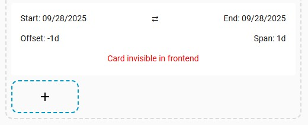

# energy-date-selector-bridge
## Goal
This card creates a bridge between the official [Energy Date Picker Card](https://www.home-assistant.io/dashboards/energy/#energy-date-picker) from Home Assistant and other cards.
This card monitors date changes of the core energy-date-selection card and outputs the selected dates to sessionStorage variables or HA helpers.
This way custom cards like [ApexCharts Card](https://github.com/RomRider/apexcharts-card) can be changed in sync with the core energy date picker.

This card is tested with the core [energy-date-selection](https://www.home-assistant.io/dashboards/energy/#energy-date-picker) card,
and with the custom [Energy Period Selector Plus](https://github.com/flixlix/energy-period-selector-plus) card.

Why this card?

  
When I first started with Home Assistant I soon stumbled upon a problem with the core Energy Date Picker. It was not able to communicate with other cards like [ApexCharts Card](https://github.com/RomRider/apexcharts-card)
I noticed I was not alone and many people where asking for this functionality for a long time.
After fidling around with other cards like [Energy Period Selector Plus](https://github.com/flixlix/energy-period-selector-plus) I did not find a solid solution and decided to start my own card to solve this problem. First I wanted to create an new datepicker with more options, but there are already such custom date pickers. so I decided to create a card that would work as a bridge between the date pickers already available and apexcharts-card.

## Features
- Synchronize to sessionStorage variables
- Synchronize to global helpers (adjustable)
- GUI Editor
- Show/hide Frontend card
- Also works with custom date picker cards who use the core energy date picker system
## ToDo

  
## Install
### HACS (recommended)
This card is available in HACS (Home Assistant Community Store). HACS is a third-party community store and is not included in Home Assistant out of the box.

- Install with HACS

Manual Install

Save the energy-date-selection-bridge.js file in the following location

    www/energy-date-selection/energy-date-selection-bridge.js
add the translations directory and his contents

    www/energy-date-selection/translations
Add the file to your HA resources, by adding the following lines to your configuration.yaml file
Or in the UI Settings > dashboards > Resources

    resources:
      - url: /local/energy-date-selection-bridge/energy-date-selection-bridge.js
        type: module

- add the card to a view
    type: custom:energy-date-selection-bridge
    no other settings are needed by default
- add a date picker card like the [Energy Date Picker Card](https://www.home-assistant.io/dashboards/energy/#energy-date-picker) to the same view
- create 1 dummy_refresh helper\
    input_number:dummy_refresh
    - 4 sessionStorage variables are set which you can use in other cards
      - session_start_date
      - session_end_date
      - session_offset
      - session_span
- Optionally create 4 helpers\
  By default the Energy Date Selection Bridge uses
  - input_datetime.energy_start_date
  - input_datetime.energy_end_date
  - input_text.energy_date_offset
  - input_text.energy_date_span
  
Id's of all helpers can be changed in config

## Synchronization
To facilitate sychronization with other cards, you have two options.\
SessionStorage variables or global helpers.\
Both return values to work together with Apexcharts card

## Options
|Name                 |Requirement|Default                             |Description                         |Options       |
|---------------------|-----------|------------------------------------|------------------------------------|--------------|
|type                 |Required   |custom:energy-date-selection-bridge |                                    |              |
|show_frontend_card   |Optional   |true                                |Show the frontend card              |true/false    |
|auto_sync_sessionvars|Optional   |true                                |Sync with sessionStorage variables  |true/false    |
|dummy_refresh_helper |Optional   |input_number.dummy_refresh          |id of the dummy_refresh_helper      |              |
|auto_sync_helpers    |Optional   |false                               |Sync with HA helpers                |true/false    |
|start_date_helper    |Optional   |input_datetime.energy_start_date    |id of the start_date_helper         |              |
|end_date_helper      |Optional   |input_datetime.energy_end_date      |id of the end_date_helper           |              |
|date_offset_helper   |Optional   |input_text.energy_date_offset       |id of the date_offset_helper        |              |
|date_span_helper     |Optional   |input_text.energy_date_span         |id of the date_span_helper          |              |
|prefer               |Optional   |energy                              |prefered date source                |energy/dom/url|
|debug                |Optional   |false                               |Show console debug                  |true/false    |

## Detailed explanation
### auto_sync_sessionvars
update the sessionStorage variables.\
A dummy_refresh_helper will be set to trigger updating apexcharts-card

Session variables

With this method each browser session can have it's own independend date values.

Session variables are stored temporarily in the browsers session storage.
This means they only remain during the active browser session.
Each browser session will have its own independent variables, which will reset after closing or refreshing the browser.
|variable name     |default|javascript call                             |
|------------------|-------|--------------------------------------------|
|session_start_date|today  |sessionStorage.getItem('session_start_date')|
|session_end_date  |today  |sessionStorage.getItem('session_end_date')  |
|session_offset    |-0d    |sessionStorage.getItem('session_offset')    |
|session_span      |1d     |sessionStorage.getItem('session_span')      |

Unfortunately apexcharts-card does not refresh natively on a change of sessionStorage variables, but only on changing entities.
A workaround for this is to create a helper which triggers a refresh.
This helper will also be global, but it only triggers a reload of the apexcharts-card
On changes you will notice a global refresh of this helper, but the session variables itself will remain independed. 

|helper name       |default|default helper id               |
|------------------|-------|--------------------------------|
|dummy_refresh     |       |input_number.dummy_refresh      |

### auto_sync_helpers 
update global HA helpers

Global helpers

With this method the date values will change for all users and browser simultaneously.

Helpers in HA are global, which means each time they change, the change affects every user, screen or browser.
You need to add these helpers to HA yourself.
You can name them according to the default helper ids
If you want to use other names, you need to specify these in the configuration.
|helper name       |default|default helper id               |
|------------------|-------|--------------------------------|
|start_date_helper |today  |input_datetime.energy_start_date|
|end_date_helper   |today  |input_datetime.energy_end_date  |
|date_offset_helper|-0d    |input_text.energy_date_offset   |
|date_span_helper  |1d     |input_text.energy_date_span     |

### show_frontend_card (default: true)
Because the card does not really provide additional important information, and is intended to work in the background, the frontend card view can be hidden in config. The card will only become visible when in edit view mode
### prefer (default: energy)
By default this card monitors the dates set by the energy-date-selection card.
The card tries several fallback systems to get dates in the folowing order
Energy > DOM > URL > Today
With the 'prefer' config parameter you can force the card to try one of these fallback systems first.
e.g. when choosing URL the card uses dates from the url in this format https://www.myurl.com?start_date=dd-mm-yyyy&end_date=dd-mm-yyyy

## examples
### Yaml example
This is a full example with all options.\
Some options are not used because they are deactivated by an other option\
The yaml will cleanup itself when default settings are used.

    type: custom:energy-date-selection-bridge
    show_card: true
    synchronize:
      auto_sync_sessionvars: true
      dummy_refresh_helper: input_number.dummy_refresh
      auto_sync_helpers: false
      start_date_helper: input_datetime.energy_start_date
      end_date_helper: input_datetime.energy_end_date
      date_offset_helper: input_text.energy_date_offset
      date_span_helper: input_text.energy_date_span
    prefer: energy
    debug: false

### apexchart-card examples
To use this bridge with ApexCharts-card or other cards, 4 variables are set, either as sessionStorage variables or as helpers.
The session variables or helpers cannot be used in Apexcharts directly because it does not accept any variables. (or I didn't find how to do that)\
The solution is to wrap the ApexChart in another card named [config-template-card](https://github.com/iantrich/config-template-card)

using sessionStorage variables

The date selector stores the start date, end date, offset and span, by default, in session variables.\
Especially span and offset are needed for apexcharts.
To trigger the apexcharts to change when the session variables change, a dummy_refresh_helper is needed.

#### Needed
- [energy-date-selection-bridge](https://github.com/VedeeM/energy-date-selection-bridge)
- [energy-date-selection](https://www.home-assistant.io/dashboards/energy/#energy-date-picker)
- [ApexCharts-Card](https://github.com/RomRider/apexcharts-card)
- [config-template-card](https://github.com/iantrich/config-template-card)
- 1 input_number helper to trigger the card update

#### The apexcharts card
The template sensors cannot be used in Apexcharts directly because it does not accept any variables. (or I didn't find how to do that)\
The solution is to wrap the ApexChart in another card named [config-template-card](https://github.com/iantrich/config-template-card)\
This example brings everything together.

    type: energy-date-selection

    type: custom:energy-date-selection-bridge
    show_frontend_card: false  // hide card from frontend

    type: custom:config-template-card          // Card adds the ability to use variables
    variables:
      OFFSET: sessionStorage.getItem('session_span')
      SPAN: sessionStorage.getItem('session_offset')
    entities:
      - sensor.my_energy_daily
      - input_number.dummy_refresh               // needed, to trigger the card refresh
    card:
      type: custom:apexcharts-card             // the actual apexchart
      graph_span: ${SPAN}
      span:
        start: day
        offset: ${OFFSET}
      series:
        - entity: sensor.my_energy_daily
          name: energie

using HA helpers

To use HA helpers two input_text helpers are needed to store the span and offset.
Optionally you can add two date/time helpers to store the start and end date.
This is not needed for the functioning of apexcharts, but can be used in a title for example.

#### Needed
- [energy-date-selection-bridge](https://github.com/VedeeM/energy-date-selection-bridge)
- [energy-date-selection](https://www.home-assistant.io/dashboards/energy/#energy-date-picker)
- [ApexCharts-Card](https://github.com/RomRider/apexcharts-card)
- [config-template-card](https://github.com/iantrich/config-template-card)
- 2 input_text helpers
- 2 date/time helpers (optional)

#### The apexcharts card
    type: energy-date-selection

    type: custom:energy-date-selection-bridge
    show_frontend_card: false  // hide card from frontend
    synchronize:
      auto_sync_helpers: true
      start_date_helper: input_datetime.energy_start_date
      end_date_helper: input_datetime.energy_end_date
      date_offset_helper: input_text.energy_date_offset
      date_span_helper: input_text.energy_date_span
    
    type: custom:config-template-card          // Card adds the ability to use variables
    variables:
      OFFSET: states['sensor.energy_date_offset'].state
      SPAN: states['sensor.energy_date_span'].state
    entities:
      - sensor.my_energy_daily
      - sensor.energy_date_offset              // needed to trigger the update when this helper changes
      - sensor.energy_date_span                // needed to trigger the update when this helper changes
    card:
      type: custom:apexcharts-card             // the actual apexchart
      graph_span: ${SPAN}
      span:
        start: day
        offset: ${OFFSET}
      series:
        - entity: sensor.my_energy_daily
          name: energie

